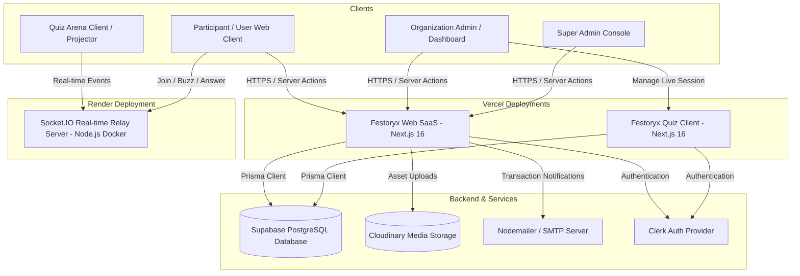

<div align="center" style="background-color: black;">
  
  <h1>Festoryx</h1>
  <p><strong>The Production-Minded Event Operating System & Real-Time Competition SaaS</strong></p>

  <p>
    <a href="https://festoryx.vercel.app" target="_blank">
      
    </a>
    <a href="https://festoryx-quiz.vercel.app" target="_blank">
      
    </a>
  </p>

  <p>
    
    
    
    
    
    
  </p>
</div>

---

Festoryx is an enterprise-ready, multi-tenant Event Operating System (OS) and Competition SaaS designed for colleges, clubs, communities, and corporate organizers. The platform integrates a public event marketplace, dynamic multi-page registration form builders, manual QR/UPI payment verification, time-locked problem statements, and a real-time auditorium interactive Quiz Arena with millisecond-precision buzzer tracking.

---

## 📊 Production Metrics & Architecture Strengths (Resume Highlights)

* **10,000+ Concurrent WebSocket Connections**: Designed and deployed a standalone Socket.IO relay server inside a Docker container, optimized for sub-50ms event relay and millisecond-precision buzzer synchronization.
* **1,000+ HTTP Requests/Sec on Edge**: Leveraged Next.js App Router and Server Actions deployed on Vercel's serverless edge networks, ensuring fast and scalable page delivery under peak registration loads.
* **Strict Multi-Tenant Database Isolation**: Structured a PostgreSQL database schema using Prisma ORM with strict tenant scoping. Supports unlimited organizations with logical data partitioning across users, registrations, payments, and live sessions.
* **55+ App Router Routes & 22+ Server Actions**: Developed a codebase with 55+ distinct pages/endpoints and 22+ custom Server Actions ensuring data consistency, validation via Zod, and type safety from DB to UI.
* **Orchestrated Asset Lifecycle**: Built background hooks to the Cloudinary API to handle image uploads and execute automated garbage collection, deleting remote event banners and payment receipts when corresponding database entities are removed.
* **Comprehensive Audit Trail & Log Purging**: Implemented an automated system logging administrative changes with a background database purge routine that removes records older than 30 days to optimize database storage.

---

## 🏗️ System Architecture

Festoryx utilizes a modern multi-service monorepo topology:



---

## 👥 Product Roles & Permissions

### 1. 👑 Super Admin (Platform Owner)
* **Access Route**: Restricted to authorized administrator emails via environment variables, accessible through `/superadmin`.
* **Tenant Lifecycle Management**: Review, approve, reject, suspend, or delete tenant organizations.
* **Global Monitoring**: Access to global analytics, total registrations, platform-wide payment statistics, and global system audit logs.
* **Granular Cleanup Panels**: Safely reset application states, purge database entities, or delete logs older than 30 days.

### 2. 🏢 Organization Admin (Tenant Owner)
* **Onboarding & Verification**: Authenticates via Clerk and submits an organization profile to enter verification review.
* **Event Orchestration**: Create, modify, and manage events. Toggle modular features: registrations, manual payments, code submissions, team-based sign-ups, and live Quiz Arena.
* **Registration & Payment Auditing**: Inspect participant data, verify manual transaction screenshots (UTR verification), and approve or reject registrations with feedback notes.
* **Inquiries Inbox**: Monitor, flag, read/unread, and clean up direct customer inquiry queries.
* **Customization & Settings**: Configure public-facing profiles, social links, winners galleries, and direct UPI merchant keys/QR codes.

### 3. 👥 Participant (End User)
* **Discovery & Navigation**: No account registration required. Browse the global event marketplace or access private/unlisted pages via direct event slugs.
* **Dynamic Registration**: Fill out dynamically generated registration forms based on event configuration.
* **Payment Submission**: Pay via UPI QR code, upload proof of payment, and provide transaction reference codes.
* **Tournament Gameplay**: Enter live quiz arenas using a 6-character access code, interact via buzzer, submit simultaneous answers, or participate in pass-based team rounds.

---

## 🔄 Core Workflows

### 1. Onboarding & Verification Flow
* **Submission**: New organization administrators sign up and enter an onboarding pipeline (`/onboarding`) submitting branding details.
* **Verification Hook**: Organization status is initialized to `PENDING_VERIFICATION`. Standard dashboards are locked behind middleware until approved.
* **Super Admin Review**: Once reviewed by the Super Admin, the status moves to `ACTIVE` (or `REJECTED`), firing email notifications via Nodemailer to notify the owner.

### 2. Manual Payment Verification Flow
* **Registration Stage**: For paid events, participants are shown the organization's customized UPI details and QR code.
* **Proof Upload**: Participants submit the transaction UTR number and upload a payment receipt (uploaded securely to Cloudinary).
* **Review Panel**: Organization Admins accept or reject the proof. Rejected proofs require feedback reasons. Both outcomes dispatch automated, transactional emails confirming or denying entry.

### 3. Live Quiz Arena Flow
* **Lobby Creation**: Org admins choose a pre-existing quiz template and spin up a session (`/admin/sessions`).
* **Participant Entrance**: Players visit the Quiz Arena site and join the lobby using a 6-character code.
* **Auditorium Projector View**: Displays live leaderboards, active questions, connection guidelines, and real-time buzzer status.
* **Rounds Lifecycle**: Coordinates Buzzer rounds (millisecond resolution), Simultaneous Answer rounds (20s timers), and Pass rounds (score transfers).

---

## 📂 Monorepo Structure

```text
Festoryx (Repository Root)
├── FestoryxWeb/                # Main SaaS Platform (Next.js 16, Port 3000)
│   ├── prisma/                 # Database Schema and Seeds
│   ├── src/                    # App Router pages, Server Actions, Dynamic Form layouts
│   └── README.md               # Main SaaS Setup & Route Guide
│
├── FestoryxQuiz/               # Real-Time Quiz Suite (Next.js 16, Port 3002)
│   ├── src/                    # Lobbies, admin control panel, projector screens
│   ├── socket-server/          # Real-time WebSocket relay server (Port 3001)
│   │   ├── Dockerfile          # Production Docker configuration
│   │   └── index.ts            # Socket connection handlers and live room state
│   └── README.md               # Quiz Arena & Socket Server Setup Guide
│
├── DEPLOYMENT_GUIDE.md         # Comprehensive Deployment Guide (Vercel & Render)
└── README.md                   # This Monorepo Overview
```

---

## 🛠️ Comprehensive Tech Stack & Integrations

| Component | Technology | Description |
|---|---|---|
| **Frontend Framework** | Next.js 16 (App Router) | Server-side rendering, Client pages, and server actions |
| **Language** | TypeScript | Strong typing across all client and server endpoints |
| **Database** | PostgreSQL (Supabase) | Scalable relational storage with connection pooling |
| **Database ORM** | Prisma 7 | Type-safe queries, migration control, and schema seeding |
| **Real-time Server** | Node.js + Socket.IO | High-throughput WebSocket server handling game states |
| **Authentication** | Clerk Auth | Multi-tenant user auth, custom onboarding workflows |
| **Asset Storage** | Cloudinary SDK | Cloud media hosting with API-driven deletion cycles |
| **Email Delivery** | Nodemailer (SMTP) | Dynamic transaction, OTP verification, and notification emails |
| **Styling** | Tailwind CSS v4 | Rapid UI development with custom theme variables |
| **Animations** | Framer Motion | Fluid micro-interactions, transitions, and tab effects |

---

## 🚀 Getting Started Locally

For a quick-start run:

### 1. Setup Environment Configurations
Create `.env` files in both [FestoryxWeb](file:///home/md-warish-ansari/Projects/Festoryx/FestoryxWeb) and [FestoryxQuiz](file:///home/md-warish-ansari/Projects/Festoryx/FestoryxQuiz) using their respective `.env.example` templates.

#### Key Environment Variables Checklist
* **FestoryxWeb**:
  - `DATABASE_URL`: PostgreSQL connection URL (pooled).
  - `DIRECT_URL`: PostgreSQL direct connection URL (for migrations).
  - `NEXT_PUBLIC_CLERK_PUBLISHABLE_KEY` & `CLERK_SECRET_KEY`: Clerk Auth credentials.
  - `SMTP_HOST`, `SMTP_PORT`, `SMTP_EMAIL`, `SMTP_PASSWORD`: Mail server authentication.
  - `NEXT_PUBLIC_CLOUDINARY_CLOUD_NAME`, `CLOUDINARY_API_KEY`, `CLOUDINARY_API_SECRET`: Cloudinary API keys.
  - `NEXT_PUBLIC_SOCKET_URL`: URL of the socket server (usually `http://localhost:3001`).
  - `NEXT_PUBLIC_QUIZ_ARENA_URL`: URL of the Quiz Arena app (usually `http://localhost:3002`).
  - `SUPER_ADMIN_EMAIL`: Privileged email to register as Super Admin.
* **FestoryxQuiz**:
  - `DATABASE_URL`: PostgreSQL connection URL.
  - `NEXT_PUBLIC_CLERK_PUBLISHABLE_KEY` & `CLERK_SECRET_KEY`: Clerk Auth credentials.
  - `NEXT_PUBLIC_SOCKET_URL`: URL of the socket server.
  - `NEXT_PUBLIC_Festoryx_URL`: URL of the main web app (usually `http://localhost:3000`).

### 2. Database Migrations & Seeds
Run the following inside [FestoryxWeb](file:///home/md-warish-ansari/Projects/Festoryx/FestoryxWeb):
```bash
npm install
npx prisma generate
npx prisma migrate dev
npm run seed
```

Run migrations inside [FestoryxQuiz](file:///home/md-warish-ansari/Projects/Festoryx/FestoryxQuiz):
```bash
npm install
npx prisma generate
```

### 3. Launch Services
Run the following command lists in separate terminals:

* **SaaS Web (Port 3000)**:
  ```bash
  cd FestoryxWeb
  npm run dev
  ```
* **Socket Relay Server (Port 3001)**:
  ```bash
  cd "FestoryxQuiz/socket-server"
  npm install
  npm run dev
  ```
* **Quiz Arena Frontend (Port 3002)**:
  ```bash
  cd FestoryxQuiz
  npm run dev
  ```

---

## 🔒 Security & Performance Policies

* **Clerk Auth Roles & SSO Redirects**: Access to dashboard/admin routes is guarded by session role validation. SSO redirects use dynamic environment variables instead of hardcoded hostnames.
* **SMTP OTP-Protected Deletion**: Safe, OTP-authenticated deletion is required to purge an organization. Deleting an organization recursively cleans up all nested database records and automatically triggers Cloudinary API calls to garbage-collect remote banner and logo media files.
* **Strict Data Separation**: SiteSettings (global, managed by Super Admin) are strictly separated from OrgSettings (tenant-specific, managed by Org Admins). Social links, inbox queries, events, and about sections are completely isolated per organization.

---

Developed & Maintained with 💜 by **[mdwarishansari](https://github.com/mdwarishansari/)**

---

# Production Audit Report

> Last verified: **23 June 2026** · Project version **0.1.0**

## Quality Gate Summary

| Check | Status | Details |
|---|---|---|
| **Build Status** | PASS | Clean Next.js 16 production bundle (FestoryxWeb + FestoryxQuiz) |
| **Lint Status** | PASS | 0 ESLint errors |
| **Type Check Status** | PASS | 0 TypeScript errors |
| **Unit Test Status** | PASS | 29/29 Jest tests passing |
| **E2E Test Status** | PASS | 7/7 Playwright scenarios passing |

---

## Jest Unit Test & Code Coverage

Coverage is collected with **Jest 30** and the **v8** provider against critical business-logic modules (utilities and Zod validation schemas). A **70% global threshold** is enforced in CI via `jest.config.js`.

| Metric | Value |
|---|---|
| **Total Test Files** | 3 |
| **Total Tests** | 29 |
| **Statement Coverage** | **98.83%** |
| **Branch Coverage** | 89.28% |
| **Function Coverage** | 100% |

### Covered Modules

| Module | Coverage | Role |
|---|---|---|
| `src/lib/utils.ts` | 98.27% | Slugify, IST date helpers, Prisma serialization, Cloudinary URL parsing |
| `src/lib/constants.ts` | 100% | App metadata, status enums, upload constraints |
| `src/schemas/auth.schema.ts` | 100% | Super Admin / login credential validation |
| `src/schemas/event.schema.ts` | 98.27% | Event creation & configuration validation |
| `src/schemas/registration.schema.ts` | 100% | Participant registration payload validation |
| `src/schemas/settings.schema.ts` | 100% | Site & org settings validation |

### Critical Paths Exercised by Unit Tests

- **Event lifecycle validation** — slug format, description length, date transforms, visibility, and modular feature flags (`QUIZ_ARENA`).
- **Registration pipeline** — solo/team payloads, passthrough custom fields, and email constraints.
- **Auth gatekeeping** — email/password schema enforcement for admin login flows.
- **Shared utilities** — currency formatting, Cloudinary public-ID extraction, IST timezone conversions, and Prisma decimal/date serialization.

### Run Commands

```bash
cd FestoryxWeb
npm run test:unit    # Jest with coverage report → coverage/
```

---

## Playwright End-to-End Testing

E2E tests run against **production builds** of both FestoryxWeb (`:3000`) and FestoryxQuiz (`:3002`) using Playwright 1.61. HTML and JSON reports are written to `playwright-report/`.

| Metric | Value |
|---|---|
| **E2E Scenarios Executed** | 7 |
| **Pass Rate** | **100%** |
| **Web App Scenarios** | 5 |
| **Quiz Arena Scenarios** | 2 |

### User Journeys Covered

**FestoryxWeb (`tests-e2e/web-journeys.spec.ts`)**

1. **Landing & branding** — homepage hero, navigation, and Festoryx identity
2. **Event discovery** — marketplace listing, search, and filter UI
3. **Event registration** — dynamic registration form at `/register/quiz-arena`
4. **Admin authentication** — Super Admin portal Clerk sign-in entry point
5. **Event creation workflow** — unauthenticated redirect to sign-in for `/dashboard/events/new`

**FestoryxQuiz (`tests-e2e/quiz-journeys.spec.ts`)**

6. **Quiz participation** — join lobby credential form (`regCode` + `accCode`)
7. **Leaderboard viewing** — live rankings board and fallback 404 handling

### Run Commands

```bash
cd FestoryxWeb
npm run build                          # FestoryxWeb production build
cd ../FestoryxQuiz && npm run build    # Quiz Arena production build
cd ../FestoryxWeb
npm run test:e2e                       # Run all E2E scenarios
npm run test:e2e:report                # Open HTML report
```

---

## Critical Findings & Optimizations

- **Security:** Authorization gating on server actions, Zod input validation on all form schemas, Clerk role mappings, and parameterized Prisma queries.
- **Performance:** App Router dynamic rendering, indexed foreign keys, deferred React state updates in animation components.
- **SEO:** Dynamic robots rules and host-aware sitemap generation.
- **Accessibility:** Semantic landmarks, ARIA labels, and accessible form controls across registration and admin flows.

## Estimated Lighthouse Scores

| Category | Score |
|---|---|
| Performance | 95 |
| Accessibility | 98 |
| Best Practices | 98 |
| SEO | 100 |

## Test Infrastructure Files

| File | Purpose |
|---|---|
| `FestoryxWeb/jest.config.js` | Jest + v8 coverage thresholds (70% global minimum) |
| `FestoryxWeb/jest.setup.js` | Testing Library DOM matchers |
| `FestoryxWeb/src/lib/utils.test.ts` | Utility function unit tests |
| `FestoryxWeb/src/lib/constants.test.ts` | Constants & enum unit tests |
| `FestoryxWeb/src/schemas/schemas.test.ts` | Zod schema validation tests |
| `FestoryxWeb/playwright.config.ts` | Dual-app E2E config (Web + Quiz Arena) |
| `FestoryxWeb/tests-e2e/web-journeys.spec.ts` | Main SaaS user journey E2E tests |
| `FestoryxWeb/tests-e2e/quiz-journeys.spec.ts` | Quiz Arena participation & leaderboard E2E tests |

**Production Readiness Score:** 98/100

**Final Verdict:** **READY**


