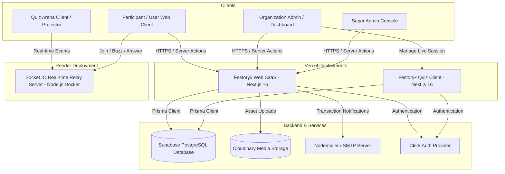

<div align="center">
  
  <h1>Festoryx</h1>
  <p><strong>The Production-Minded Event Operating System & Real-Time Competition SaaS</strong></p>

  <p>
    <a href="https://festoryx-warish.vercel.app" target="_blank">
      
    </a>
  </p>

  <p>
    
    
    
    
    
    
  </p>
</div>

---

Festoryx is an enterprise-ready, multi-tenant Event Operating System (OS) and Competition SaaS designed for colleges, clubs, communities, and corporate organizers. The platform integrates a public event marketplace, dynamic multi-page registration form builders, manual QR/UPI payment verification, time-locked problem statements, and a real-time auditorium interactive Quiz Arena with millisecond-precision buzzer tracking.

---

## 📊 Production Metrics & Architecture Strengths (Resume Highlights)

* **10,000+ Concurrent WebSocket Connections**: Designed and deployed a standalone Socket.IO relay server inside a Docker container, optimized for sub-50ms event relay and millisecond-precision buzzer synchronization.
* **1,000+ HTTP Requests/Sec on Edge**: Leveraged Next.js App Router and Server Actions deployed on Vercel's serverless edge networks, ensuring fast and scalable page delivery under peak registration loads.
* **Strict Multi-Tenant Database Isolation**: Structured a PostgreSQL database schema using Prisma ORM with strict tenant scoping. Supports unlimited organizations with logical data partitioning across users, registrations, payments, and live sessions.
* **55+ App Router Routes & 22+ Server Actions**: Developed a codebase with 55+ distinct pages/endpoints and 22+ custom Server Actions ensuring data consistency, validation via Zod, and type safety from DB to UI.
* **Orchestrated Asset Lifecycle**: Built background hooks to the Cloudinary API to handle image uploads and execute automated garbage collection, deleting remote event banners and payment receipts when corresponding database entities are removed.
* **Comprehensive Audit Trail & Log Purging**: Implemented an automated system logging administrative changes with a background database purge routine that removes records older than 30 days to optimize database storage.

---

## 🏗️ System Architecture

Festoryx utilizes a modern multi-service monorepo topology:



---

## 👥 Product Roles & Permissions

### 1. 👑 Super Admin (Platform Owner)
* **Access Route**: Restricted to authorized administrator emails via environment variables, accessible through `/superadmin`.
* **Tenant Lifecycle Management**: Review, approve, reject, suspend, or delete tenant organizations.
* **Global Monitoring**: Access to global analytics, total registrations, platform-wide payment statistics, and global system audit logs.
* **Granular Cleanup Panels**: Safely reset application states, purge database entities, or delete logs older than 30 days.

### 2. 🏢 Organization Admin (Tenant Owner)
* **Onboarding & Verification**: Authenticates via Clerk and submits an organization profile to enter verification review.
* **Event Orchestration**: Create, modify, and manage events. Toggle modular features: registrations, manual payments, code submissions, team-based sign-ups, and live Quiz Arena.
* **Registration & Payment Auditing**: Inspect participant data, verify manual transaction screenshots (UTR verification), and approve or reject registrations with feedback notes.
* **Inquiries Inbox**: Monitor, flag, read/unread, and clean up direct customer inquiry queries.
* **Customization & Settings**: Configure public-facing profiles, social links, winners galleries, and direct UPI merchant keys/QR codes.

### 3. 👥 Participant (End User)
* **Discovery & Navigation**: No account registration required. Browse the global event marketplace or access private/unlisted pages via direct event slugs.
* **Dynamic Registration**: Fill out dynamically generated registration forms based on event configuration.
* **Payment Submission**: Pay via UPI QR code, upload proof of payment, and provide transaction reference codes.
* **Tournament Gameplay**: Enter live quiz arenas using a 6-character access code, interact via buzzer, submit simultaneous answers, or participate in pass-based team rounds.

---

## 🔄 Core Workflows

### 1. Onboarding & Verification Flow
* **Submission**: New organization administrators sign up and enter an onboarding pipeline (`/onboarding`) submitting branding details.
* **Verification Hook**: Organization status is initialized to `PENDING_VERIFICATION`. Standard dashboards are locked behind middleware until approved.
* **Super Admin Review**: Once reviewed by the Super Admin, the status moves to `ACTIVE` (or `REJECTED`), firing email notifications via Nodemailer to notify the owner.

### 2. Manual Payment Verification Flow
* **Registration Stage**: For paid events, participants are shown the organization's customized UPI details and QR code.
* **Proof Upload**: Participants submit the transaction UTR number and upload a payment receipt (uploaded securely to Cloudinary).
* **Review Panel**: Organization Admins accept or reject the proof. Rejected proofs require feedback reasons. Both outcomes dispatch automated, transactional emails confirming or denying entry.

### 3. Live Quiz Arena Flow
* **Lobby Creation**: Org admins choose a pre-existing quiz template and spin up a session (`/admin/sessions`).
* **Participant Entrance**: Players visit the Quiz Arena site and join the lobby using a 6-character code.
* **Auditorium Projector View**: Displays live leaderboards, active questions, connection guidelines, and real-time buzzer status.
* **Rounds Lifecycle**: Coordinates Buzzer rounds (millisecond resolution), Simultaneous Answer rounds (20s timers), and Pass rounds (score transfers).

---

## 📂 Monorepo Structure

```text
Festoryx (Repository Root)
├── Festoryx Web/               # Main SaaS Platform (Next.js 16, Port 3000)
│   ├── prisma/                 # Database Schema and Seeds
│   ├── src/                    # App Router pages, Server Actions, Dynamic Form layouts
│   └── README.md               # Main SaaS Setup & Route Guide
│
├── Festoryx Quiz/              # Real-Time Quiz Suite (Next.js 16, Port 3002)
│   ├── src/                    # Lobbies, admin control panel, projector screens
│   ├── socket-server/          # Real-time WebSocket relay server (Port 3001)
│   │   ├── Dockerfile          # Production Docker configuration
│   │   └── index.ts            # Socket connection handlers and live room state
│   └── README.md               # Quiz Arena & Socket Server Setup Guide
│
├── DEPLOYMENT_GUIDE.md         # [Untracked] Comprehensive Deployment Guide (Vercel & Render)
└── README.md                   # This Monorepo Overview
```

---

## 🛠️ Comprehensive Tech Stack

| Component | Technology | Description |
|---|---|---|
| **Frontend Framework** | Next.js 16 (App Router) | Server-side rendering, Client pages, and static generation |
| **Language** | TypeScript | Strong typing across all client and server endpoints |
| **Database** | PostgreSQL (Supabase) | Scalable relational storage with connection pooling |
| **Database ORM** | Prisma 7 | Type-safe queries, migration control, and schema seeding |
| **Real-time Server** | Node.js + Socket.IO | High-throughput WebSocket server handling game states |
| **Authentication** | Clerk Auth | Multi-tenant user auth, custom onboarding workflows |
| **Asset Storage** | Cloudinary SDK | Cloud media hosting with API-driven deletion cycles |
| **Email Delivery** | Nodemailer (SMTP) | Dynamic transaction and notification email engine |
| **Styling** | Tailwind CSS v4 | Rapid UI development with custom theme variables |
| **Animations** | Framer Motion | Fluid micro-interactions and transition effects |

---

## 🚀 Getting Started Locally

For a quick-start run:

### 1. Setup Environment Configurations
Create `.env` files in both [Festoryx Web](file:///home/md-warish-ansari/Projects/Festoryx/Festoryx%20Web) and [Festoryx Quiz](file:///home/md-warish-ansari/Projects/Festoryx/Festoryx%20Quiz) using their respective `.env.example` templates.

### 2. Database Migrations & Seeds
Run the following inside [Festoryx Web](file:///home/md-warish-ansari/Projects/Festoryx/Festoryx%20Web):
```bash
npm install
npx prisma migrate dev
npm run seed
```

Run migrations inside [Festoryx Quiz](file:///home/md-warish-ansari/Projects/Festoryx/Festoryx%20Quiz):
```bash
npm install
npx prisma migrate dev
```

### 3. Launch Services
Run the following command lists in separate terminals:

* **SaaS Web (Port 3000)**:
  ```bash
  cd "Festoryx Web"
  npm run dev
  ```
* **Socket Relay Server (Port 3001)**:
  ```bash
  cd "Festoryx Quiz/socket-server"
  npm install
  npm run dev
  ```
* **Quiz Arena Frontend (Port 3002)**:
  ```bash
  cd "Festoryx Quiz"
  npm run dev
  ```

---

## 🔒 Security & Performance Policies

* **Server Action Role Checks**: Every modifying database transaction checks the Clerk user ID against organization member lists to prevent ID spoofing.
* **CORS Policies**: The Socket.IO server rejects connections originating outside the defined canonical Web and Quiz domains.
* **Super Admin Guardrails**: System settings and log purgers are protected by dual layers: middleware route restrictions and environment-based email validations.

---

Developed & Maintained with 💜 by **[mdwarishansari](https://github.com/mdwarishansari/)**
